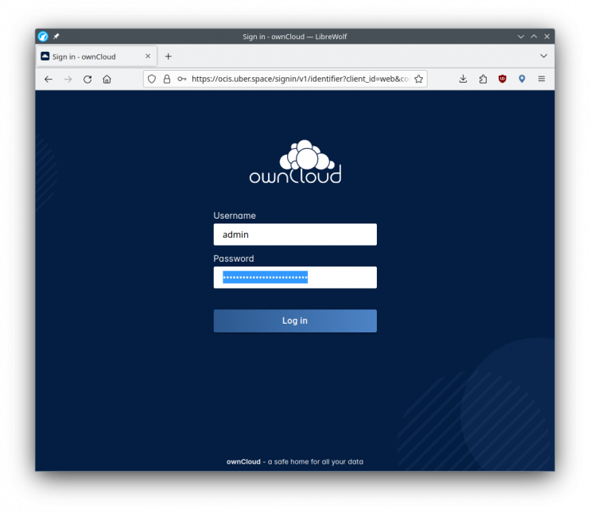

[comment]: # Is there a style guide?

[comment]: # How to do inline URLs and where to put the videos?




## Uberspace and ownCloud Infinite Scale in 50 seconds

This howto shows how to set up ownCloud Infinite Scale for a quick test. For convenience, we will use the free service from the Ubernauten -- Join us here: [Uberspace Registration Page](https://dashboard.uberspace.de/register?lang=en). They offer free of charge (for the first month) web hosting.

In this documentation, we are assuming you already have an account there and it is configured for SSH access. This guide is using "ocis.uber.space" as a domain at Uberspace, version 4.0.2 of Infinite Scale and the local user "owncloud". Make sure you adapt the example code and scripts mentioned in this page to your needs Both username and domain will be set when you sign in to Uberspace.

Installing ownCloud Infinite Scale on Ubernauten is pretty straigt-forward, you can do it in three steps that take less than a minute: Here's a short video that shows how fast the whole process actually is - thanks to Infinite Scale's cloud native architecture. [ownCloud Infinite Scale in 50 seconds](./ubernauten_media/001-OCIS-in-50-seconds-2023-10-17.mkv)

[comment]: # Fix URL, put video in a location that makes sense. Is mkv Ok?

### Three Steps to your Infinite UberSpace

* Download the Infinite Scale binary and make it executable
```
curl https://download.owncloud.com/ocis/ocis/stable/4.0.2/ocis-4.0.2-linux-amd64 --output ocis
chmod +x ocis
```

* Set some environment variables related to Uberspace (**Make sure you fill in YOUR domain!**)
```
uberspace web backend set / --http --port 9200
export OCIS_URL=https://ocis.uber.space
export PROXY_TLS=false
export PROXY_HTTP_ADDR=0.0.0.0:9200
export PROXY_LOG_LEVEL=debug
```

* Start the `ocis` binary, first with the parameter `init` for initial configuration. This will also give you your unique login password for the user `admin`. Once finished, call `ocis start`:
```
./ocis init
./ocis server
```
Wait a few seconds, now you can visit the url of your uberspace server and login: 

To make it easier (and faster), here's the commands in a script called `ocis.install`:

```
#!/bin/bash
# This file is named ocis.install
# It downloads ocis, configures the environment varibles and starts
# ownCloud Infinite Scale on a ubernauten account. You can run it in your home directory

curl https://download.owncloud.com/ocis/ocis/stable/4.0.2/ocis-4.0.2-linux-amd64 --output ocis
chmod +x ocis
uberspace web backend set / --http --port 9200
export OCIS_URL=https://ocis.uber.space
export PROXY_TLS=false
export PROXY_HTTP_ADDR=0.0.0.0:9200
export PROXY_LOG_LEVEL=debug
./ocis init
./ocis server
```

### Service Management with Supervisord

If you want `ocis` to run continuously, you need to configure `supervisord` (http://supervisord.org) which is the tool Uberspace is using for service management.

You can start and stop services with `supervisorctl`, it will (re)read configuration files it finds in your home directory, under `etc/services.d/`, in `.ini` files. The content of these files is very simple, you only have to enter three lines, here is the example for Infinite Scale in `/home/owncloud/etc/services.d/ocis.ini`.

```
[program:ocis]
command="/home/owncloud/ocis.start"
startsecs=60
```

`ocis.start` is a script that combines all of the commands above except for the download of the ocis binary. It looks like this:

```
#!/bin/bash
# This file is named ocis.start.
# It sets environment variables needed for uber.space needed for Infinite Scale
/usr/bin/uberspace web backend set / --http --port 9200 &
export OCIS_URL=https://ocis.uber.space
export PROXY_TLS=false
export PROXY_HTTP_ADDR=0.0.0.0:9200
export PROXY_LOG_LEVEL=debug
/home/ocis/ocis server
```

There are three supervisorctl commands that you will find useful (many more can be found in its documentation). You can use `supervisorctl status` to check which services managed by supervisorctl are running, a `supervisorctl reread` will be necessary after you changed the `ini` files, and an `update` is applying the changes:

```
[owncloud@ocis ~]$ supervisorctl status
ocis                             RUNNING   pid 9813, uptime 0:01:40
[owncloud@ocis ~]$ supervisorctl reread
No config updates to processes
[owncloud@ocis ~]$ supervisorctl update
```

### Updating ownCloud Infinite Scale

Updating the ocis binary is simple: When a new version comes to life, just download the new `ocis` binary from the download server, replacing the old `ocis` executable on your uberspace server.

Make a backup of your data and make sure you have read and understood the release notes of your new version , especially the "breaking changes" section before starting the binary.

Don't worry, you can always go back to the older version you had installed, there's a long list of older versions available for download.

### Wiping and Clean Restart from Scratch

This little script is removing your ocis installation (and ==all of your data!==), replacing it with a new, clean ocis installation. Be careful and only use it for testing purposes. Specify your desired ocis version in the curl command.

```
#!/bin/bash
# This file is named ocis.reinstall
# It deletes the old ocis installation, fetches a new binary and starts ocis.
rm -rf .ocis
curl https://download.owncloud.com/ocis/ocis/stable/4.0.2/ocis-4.0.2-linux-amd64 --output ocis
chmod +x ocis
uberspace web backend set / --http --port 9200
export OCIS_URL=https://ocis.uber.space
export PROXY_TLS=false
export PROXY_HTTP_ADDR=0.0.0.0:9200
export PROXY_LOG_LEVEL=debug
./ocis init
./ocis server
```

### Troubleshooting

* Some older versions of Infinite Scale also needed this Environment variable to run.
```
export THUMBNAILS_WEBDAVSOURCEBASE_URL=http://localhost:9200/remote.php/webdav/
```
This should not be necessary for all versions starting with ownCloud Infinite Scale 3.0.

* If you get the following error message, then you probably forgot to run the `ocis init` command. If `ocis server` find an configuration hasn't been set up, it will complain like this:
```
[owncloud@ocis ~]$ ./ocis server
The jwt_secret has not been set properly in your config for ocis.
Make sure your /home/mfeilner/.ocis/config config contains the proper values
(e.g. by running ocis init or setting it manually in the config/corresponding
environment variable).
```
